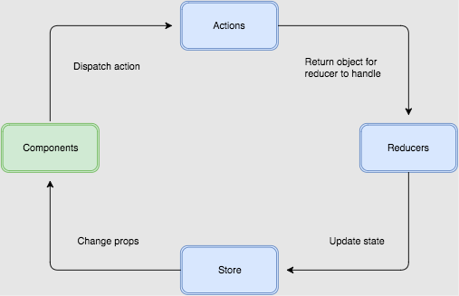
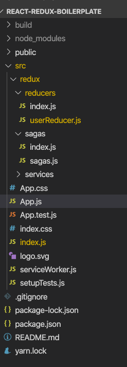

[Redux](https://react-redux.js.org/introduction/quick-start) is the most popular State container library for frontend apps. It helps you manage your state in a predictable and easy way.


Redux Flow

This post is about setting up Redux on your new/existing React app.

### **Create react APP**

I am taking the most popular React-boilerplate (create-react-app).

If you are very new to React and do not know what create-react-app is, then follow the link below.

```
npx create-react-app my-app
cd my-app
npm start
```

[https://reactjs.org/docs/create-a-new-react-app.html](https://reactjs.org/docs/create-a-new-react-app.html)

### **Redux Documentation**

You can find the official documentation of Redux on the link below.

[https://redux.js.org/introduction/getting-started](https://redux.js.org/introduction/getting-started)

### **Do you really need Redux in React?**


 

Before implementing Redux, I would highly recommend that you go to this post below by the creator of Redux ([Dan Abramov](https://twitter.com/dan_abramov)).

[https://medium.com/@dan\_abramov/you-might-not-need-redux-be46360cf367](https://medium.com/@dan_abramov/you-might-not-need-redux-be46360cf367)

Now, if you are sure that you want to use Redux than, let's get started.

### Prerequisites

Basic knowledge of JavaScript and React.  
Basic understanding of create-react-app.

### **Setup CRA (create-react-app)**

Install the Desired Packages

redux — The base package  
react-redux — Package to use the Redux features according to React

**Install the npm Packages**
```
npm install redux react-redux redux-saga
```
### **Redux Folder Structure**

Create a Folder named Redux in src which contains the following folders

1.  Reducers
2.  Saga


                                    APP — Foder Structure

### **Import the Libraries**

In the index.js, include the following dependencies
```
// Redux Library Packages  
 import { Provider } from “react-redux”;  
 import createSagaMiddleware from ‘redux-saga’;  
 import { createStore, applyMiddleware, compose } from “redux”;  
 import { logger } from ‘redux-logger’;

 // Custom redux Elements  
 import rootReducer from “./redux/reducers/index”;  
import rootSaga from “./redux/sagas/index”;
```
#### **Attach the Provider to the APP**
```
const userReducer = (state, action) =>{  
switch (action.type) {  
 case “USER\_FETCH\_REQUESTED”:  
 return { …state, response: null, loading: true }  
 case “USER\_FETCH\_SUCCEEDED”:  
 return { …state, response: action.response, loading: false }  
 default:  
 return {  
 response: “No Response”  
 };  
 }  
}
```
#### **Add the Reducers**
```
const globalReducer = createStore(  
 rootReducer,  
 compose(   
 applyMiddleware(sagaMiddleware, logger)  
 ));
```
The `<Provider />` makes the Redux store available to any nested components that are using the `useSelector` hook.
```
 <Provider >  
   <App />  
 </Provider>
```
**Attach the Reducers to the providers**
```
<Provider store={globalReducer}>  
  <App />  
</Provider>
```
**Get the Global State into your App**
```
import { useSelector } from “react-redux”;

const globalState = useSelector(state => state);
```
**Dispatch the Action on Event**
```
const getUserData = () => {  
 // Get the Data for the User  
 dispatch({ type: “USER\_FETCH\_REQUESTED”})  
}
```
**Attach An API Call to the Action**
```
import { call, put, takeLatest } from ‘redux-saga/effects’  
  
const getRecords = (uid = null) => {  
const results = fetch(‘[https://jsonplaceholder.typicode.com/todos/1'](https://jsonplaceholder.typicode.com/todos/1%27))  
 .then(response => response.json());   
 return results;  
}

// worker Saga: will be fired on USER\_FETCH\_REQUESTED actions  
function\* fetchUser(action) {  
 try {  
 const json = yield call(getRecords, 400);  
 yield put({type: “USER\_FETCH\_SUCCEEDED”, response: json});  
 } catch (e) {  
 yield put({type: “USER\_FETCH\_FAILED”, message: e.message});  
 }  
}

function\* mySaga() {  
 yield takeLatest(“USER\_FETCH\_REQUESTED”, fetchUser);  
}

export default mySaga;
```
**Run the Code and See the Action**

**Final app.js file**

Your final app.js will look like this.

Final APP.js file

**Run the Code and See the Action**

Open localhost:3000/

**Working Example**

[https://react-redux-example.netlify.app/](https://react-redux-example.netlify.app/)

CodeSandBox

[https://codesandbox.io/s/github/tarun-nagpal-github/react-redux-boilerplate](https://codesandbox.io/s/github/tarun-nagpal-github/react-redux-boilerplate)


**GitHub Repo for this example**

[https://github.com/tarun-nagpal-github/react-redux-boilerplate](https://github.com/tarun-nagpal-github/react-redux-boilerplate)

### **Conclusion**

In this post, we have picked a fresh React app and implemented Redux with a sample action.

I have just set up one, but you can expand it and use it in your project. Feel free to ask for any help in comments.